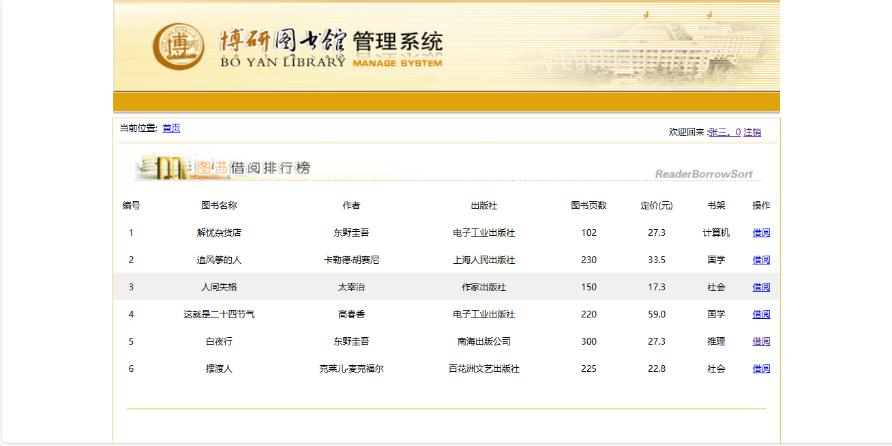
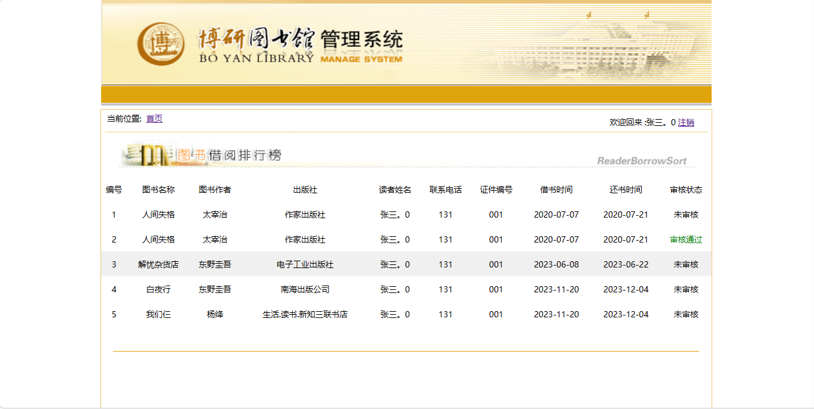
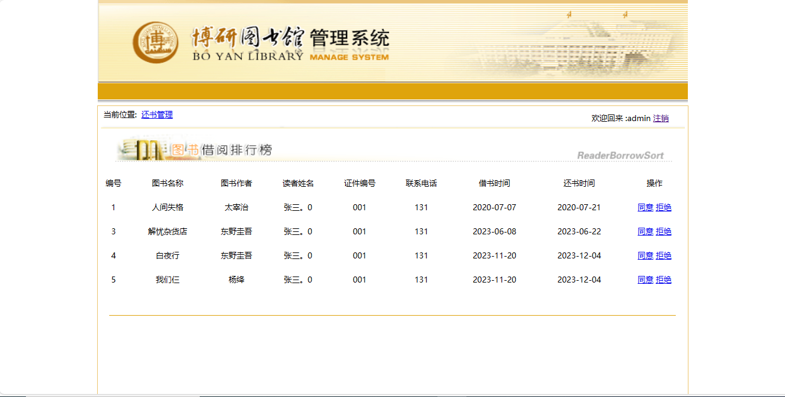
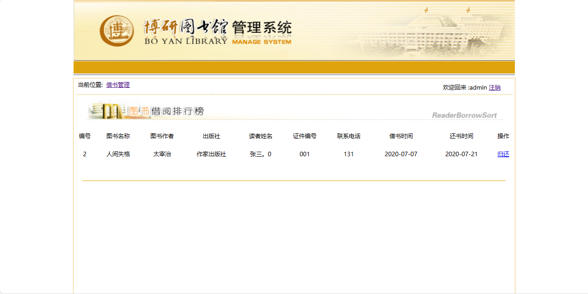

<h1 align="center">18.基于servlet的图书馆管理系统</h1>

 获取sql文件 QQ: 386869957 QQ群: 377586148 

 [个人站点: 从戎源码网](https://armycodes.com/) 

## 简介

> 本代码来源于网络,仅供学习参考使用!
>
> 提供1.远程部署/2.修改代码/3.设计文档指导/4.框架代码讲解等服务
>
> 登录地址：http://localhost:8080/
>
> 读者: user   密码: 123456
> 
> 管理员: admin   密码: 123456
>

## 项目介绍

基于servlet的图书馆管理系统：前端jsp、jquery，后端 servlet，系统分为读者和图书馆管理员，读者在线浏览图书实现借书，管理员可以对借书进行同意和拒绝操作；主要功能如下：

### 读者：

- 基本功能：登录、注销
- 核心功能：图书借阅排行榜（字段包括图书名称、图书作者、读者姓名、证件编号、联系电话、借书时间、还书时间）、图书列表分页、借阅操作、查看图书借阅后管理员审核状态

### 图书馆管理员：

- 基本功能：登录、注销
- 核心功能：读者借阅图书记录、分页查询、同意操作、拒绝操作、待归还列表、归还操作

## 环境

- <b>IntelliJ IDEA 2009.3</b>

- <b>Mysql 5.7.26</b>

- <b>Tomcat 7.0.73</b>

- <b>JDK 1.8</b>

## 运行截图

